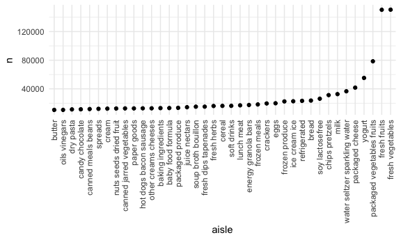
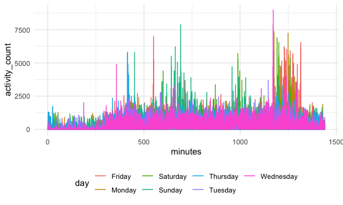

Homework 3
================
Chloe Chah
2020-10-08

### Problem 1

``` r
data("instacart")
```

This dataset contains 1384617 rows and 15 columns. Observations are the
level of items in orders by users. There are user/order variables – user
ID, order ID, order day, and order hour. There are also item variables –
name, aisle, department, and some numeric codes.

#### Number of aisles and which aisles are the most items ordered from?

``` r
instacart %>%
  count(aisle) %>%
  arrange(desc(n))
```

    ## # A tibble: 134 x 2
    ##    aisle                              n
    ##    <chr>                          <int>
    ##  1 fresh vegetables              150609
    ##  2 fresh fruits                  150473
    ##  3 packaged vegetables fruits     78493
    ##  4 yogurt                         55240
    ##  5 packaged cheese                41699
    ##  6 water seltzer sparkling water  36617
    ##  7 milk                           32644
    ##  8 chips pretzels                 31269
    ##  9 soy lactosefree                26240
    ## 10 bread                          23635
    ## # … with 124 more rows

It seems like the top 3 aisles where the most items are ordered from are
“fresh vegetables”, “fresh fruits”, and “packaged vegetable fruits”.

#### Make a plot that shows the number of items ordered in each aisle, limiting this to aisles with more than 10000 items ordered.

``` r
instacart %>%
  count(aisle) %>%
  filter(n > 10000) %>%
  mutate(
    aisle = factor(aisle),
    aisle = fct_reorder(aisle, n)
  ) %>%
  ggplot(aes(x = aisle, y = n)) + 
  geom_point() + 
  theme(axis.text.x = element_text(angle = 90, vjust = 0.5, hjust = 1)) 
```



#### Make a table showing the three most popular items in each of the aisles “baking ingredients”, “dog food care”, and “packaged vegetables fruits”. Include the number of times each item is ordered in your table.

``` r
instacart %>%
  filter(aisle %in% c("baking ingredients", "dog food care", "packaged vegetables fruits")) %>%
  group_by(aisle) %>%
  count(product_name) %>%
  mutate(rank = min_rank(desc(n))) %>%
  filter(rank < 4) %>%
  arrange(aisle, rank) %>%
  knitr::kable()
```

| aisle                      | product\_name                                 |    n | rank |
| :------------------------- | :-------------------------------------------- | ---: | ---: |
| baking ingredients         | Light Brown Sugar                             |  499 |    1 |
| baking ingredients         | Pure Baking Soda                              |  387 |    2 |
| baking ingredients         | Cane Sugar                                    |  336 |    3 |
| dog food care              | Snack Sticks Chicken & Rice Recipe Dog Treats |   30 |    1 |
| dog food care              | Organix Chicken & Brown Rice Recipe           |   28 |    2 |
| dog food care              | Small Dog Biscuits                            |   26 |    3 |
| packaged vegetables fruits | Organic Baby Spinach                          | 9784 |    1 |
| packaged vegetables fruits | Organic Raspberries                           | 5546 |    2 |
| packaged vegetables fruits | Organic Blueberries                           | 4966 |    3 |

#### Make a table showing the mean hour of the day at which Pink Lady Apples and Coffee Ice Cream are ordered on each day of the week; format this table for human readers.

``` r
instacart %>%
  filter(product_name %in% c("Pink Lady Apples", "Coffee Ice Cream")) %>%
  group_by(product_name, order_dow) %>%
  summarize(mean_hour = mean(order_hour_of_day)) %>%
  pivot_wider(
    names_from = order_dow, 
    values_from = mean_hour
  )
```

    ## `summarise()` regrouping output by 'product_name' (override with `.groups` argument)

    ## # A tibble: 2 x 8
    ## # Groups:   product_name [2]
    ##   product_name       `0`   `1`   `2`   `3`   `4`   `5`   `6`
    ##   <chr>            <dbl> <dbl> <dbl> <dbl> <dbl> <dbl> <dbl>
    ## 1 Coffee Ice Cream  13.8  14.3  15.4  15.3  15.2  12.3  13.8
    ## 2 Pink Lady Apples  13.4  11.4  11.7  14.2  11.6  12.8  11.9

### Problem 2

#### Load, tidy, wrangle the data.

``` r
accel_df = 
  read_csv("./Data/accel_data.csv") %>%
  janitor::clean_names() %>%
  pivot_longer(
    activity_1:activity_1440, 
    names_to = "minutes", 
    names_prefix = "activity_", 
    values_to = "activity_count"
  ) %>% 
  mutate(minutes = as.numeric(minutes), 
         day_num = recode(day, "Monday" = "1", 
                             "Tuesday" = "2", 
                             "Wednesday" = "3", 
                             "Thursday" = "4", 
                             "Friday" = "5", 
                             "Saturday" = "6", 
                             "Sunday" = "7")
  ) %>%
  mutate(
    weekday_vs_weekend = case_when(
      day_num <=5 ~ "Weekday", 
      day_num > 5 ~ "Weekend", 
      TRUE ~ ""
    )
  ) %>%
  
  select(-day_num)
```

    ## Parsed with column specification:
    ## cols(
    ##   .default = col_double(),
    ##   day = col_character()
    ## )

    ## See spec(...) for full column specifications.

The accelarator dataset contains information regarding the following
variables: activity\_count, day, day\_id, minutes, week,
weekday\_vs\_weekend. There are a total of 50400 row and 6 columns in
the final dataset.

#### Aggregate accross minutes to create a total activity variable for each day.

``` r
accel_df %>%
  group_by(week, day_id) %>%
  summarize(
    total_activity = sum(activity_count)
  ) %>%
  knitr::kable()
```

    ## `summarise()` regrouping output by 'week' (override with `.groups` argument)

| week | day\_id | total\_activity |
| ---: | ------: | --------------: |
|    1 |       1 |       480542.62 |
|    1 |       2 |        78828.07 |
|    1 |       3 |       376254.00 |
|    1 |       4 |       631105.00 |
|    1 |       5 |       355923.64 |
|    1 |       6 |       307094.24 |
|    1 |       7 |       340115.01 |
|    2 |       8 |       568839.00 |
|    2 |       9 |       295431.00 |
|    2 |      10 |       607175.00 |
|    2 |      11 |       422018.00 |
|    2 |      12 |       474048.00 |
|    2 |      13 |       423245.00 |
|    2 |      14 |       440962.00 |
|    3 |      15 |       467420.00 |
|    3 |      16 |       685910.00 |
|    3 |      17 |       382928.00 |
|    3 |      18 |       467052.00 |
|    3 |      19 |       371230.00 |
|    3 |      20 |       381507.00 |
|    3 |      21 |       468869.00 |
|    4 |      22 |       154049.00 |
|    4 |      23 |       409450.00 |
|    4 |      24 |         1440.00 |
|    4 |      25 |       260617.00 |
|    4 |      26 |       340291.00 |
|    4 |      27 |       319568.00 |
|    4 |      28 |       434460.00 |
|    5 |      29 |       620860.00 |
|    5 |      30 |       389080.00 |
|    5 |      31 |         1440.00 |
|    5 |      32 |       138421.00 |
|    5 |      33 |       549658.00 |
|    5 |      34 |       367824.00 |
|    5 |      35 |       445366.00 |

The patient seems to be most active on Fridays and the least active on
Saturdays.

#### Make a single-panel plot that shows the 24-hour activity time courses for each day.

``` r
accel_df %>%
ggplot(aes(x = minutes, y = activity_count, color = day)) +
  geom_line()
```



Based on the graph, it seems like the patient is more active during the
day on Sundays and more active in the evening on Fridays. A noticeable
trend is that the time at which the patient is more active seems to
depend on which day of the week it is.

### Problem 3

  - second question: data manipulation steps –\> plotting step, group by
    will depend on a variety of things, filter, then summarize
  - third question: filter first then plot
